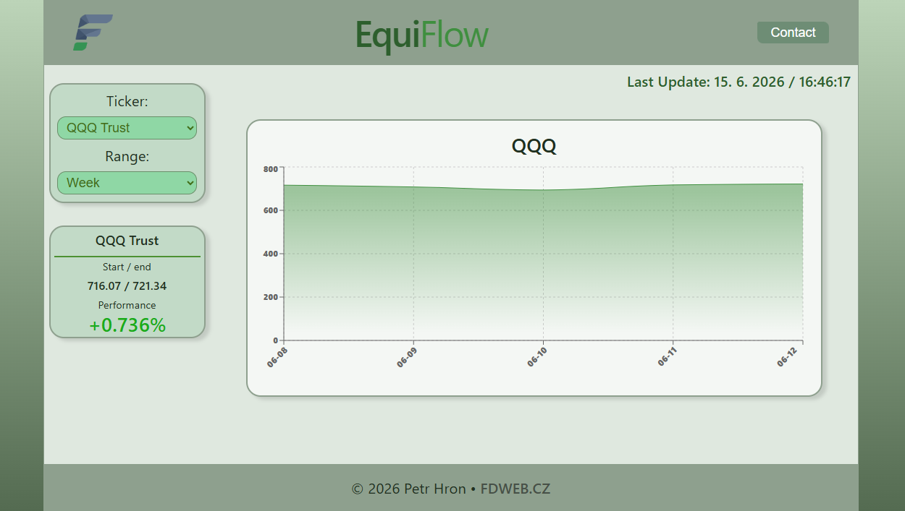

# EquiFlow Client

Frontendová část projektu EquiFlow.

EquiFlow je experimentální projekt zaměřený na práci s historickými daty finančních aktiv (akcie, ETF).

Projekt se skládá z:

* backendového REST API postaveného na Spring Boot
* frontendového dashboardu postaveného na Reactu
* PostgreSQL databáze pro ukládání historických dat

Cílem projektu je postupně vybudovat jednoduchý analytický engine pro práci s finančními časovými řadami a investičními daty.

## Související repozitáře

Frontend:
https://github.com/FD-technic/equiflow-client

Backend:
https://github.com/FD-technic/equiflow-backend

## Live Demo

#### Frontend: https://equiflow.ferdo.eu
#### API: https://api.equiflow.ferdo.eu

---

## Popis
Frontend poskytuje webové rozhraní pro vizualizaci historických dat finančních aktiv.

Data jsou načítána z backendového API a zobrazována pomocí interaktivních grafů a přehledových statistik.

## Ukázka aplikace




## Funkce
- zobrazení historických dat finančních aktiv
- výběr ticker symbolu
- přepínání časového období
- interaktivní graf vývoje ceny
- zobrazení základního výnosu
- komunikace s backend REST API

## Technologie
- React
- TypeScript
- Vite
- CSS

## Architektura
```
Browser
    │
    ▼
React Client
    │
    ▼
REST API
    │
    ▼
Spring Boot Backend
    │
    ▼
PostgreSQL
```

## Spuštění projektu
### Požadavky
- Node.js 20+
- npm

### Instalace

V kořenové složce projektu:

```bash
npm install
```

### Spuštění

```bash
npm run dev
```

Po spuštění bude aplikace dostupná na:

http://localhost:5173


### Build produkční verze

```bash
npm run build
```

Výstup bude vytvořen ve složce:

dist

### Konfigurace

Adresa backend API se nastavuje pomocí konfiguračních proměnných.

Například:

VITE_API_URL=http://localhost:8080

### Uživatelské rozhraní

Dashboard umožňuje:

1. vybrat finanční aktivum pomocí ticker symbolu
2. zvolit časový rozsah dat
3. zobrazit vývoj ceny v grafu
4. sledovat základní výkonnost aktiva

## Aktuální stav
### Hotovo
- React + TypeScript aplikace
- komunikace s backend API
- načítání historických dat
- interaktivní graf
- přepínání tickerů
- přepínání časových období
- responzivní rozložení

### Plánované
- porovnání více aktiv
- portfolio dashboard
- pokročilé metriky
- export dat
- vylepšení UI

## Dokumentace

Další dokumentace:

- architecture.md
- roadmap.md

## Licence

Projekt slouží jako výukový a portfolio projekt.

